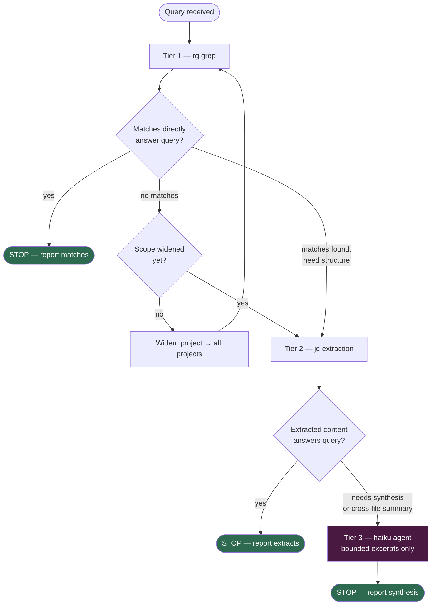

# search-conversations

Search Claude Code conversation transcripts cheaply. Grep first, jq second,
haiku last.

```
/search-conversations <query> [--project <slug>] [--limit 10] [--scope user|assistant|all]
```

---

## Ground rules — read before every run

<MANDATORY>
1. **Never read a whole JSONL file.** They are 64KB–1.4MB each. Always grep or jq-filter first.
2. **Start with the current project.** Expand to all projects only if zero results.
3. **Cap results at `--limit` (default 10).** Return after limit hit; don't exhaust all matches.
4. **Haiku agent scope must be bounded.** Pass ≤5 file excerpts, ≤2000 chars each. No full files.
</MANDATORY>
<REQUIREMENTS>
5. **`rg` over `grep`.** Faster, auto-binary-skip, color off (`--color=never`) for clean output.
</REQUIREMENTS>

---

## Layout reference

```
~/.claude/
  projects/<slug>/
    <sessionId>.jsonl          # main transcript — one JSON event per line
    <sessionId>/subagents/
      agent-<id>.jsonl         # subagent transcript
    memory/                    # memory files (not transcripts)
  transcripts/ses_*.jsonl      # desktop / cross-project sessions (different shape)
```

Slug for current project:
```bash
echo "-${PWD//\//-}"
```

---

## JSONL event shape (key fields only)

```json
{
  "type": "user" | "assistant" | "tool_use" | "tool_result",
  "sessionId": "...",
  "timestamp": "...",
  "isSidechain": true,          // subagent message if present
  "message": {
    "role": "user" | "assistant",
    "content": [
      {"type": "text", "text": "..."},
      {"type": "tool_use", "name": "Write", "input": {...}},
      {"type": "tool_result", "content": "..."}
    ]
  }
}
```

---

## Escalation decision logic

Stop at the current tier if you can answer the query with what you have.
Escalate only when you provably cannot.



**Escalation is asymmetric.** grep output is free; jq is cheap; haiku costs
tokens and latency. The bar to escalate is "I cannot answer without it,"
not "it would be easier with it."

**Scope widening happens before tier escalation.** If grep finds nothing in
the current project, expand to all projects and retry grep — don't jump to
haiku because grep returned empty.

---

## Tiered search — execute in order, stop when you have enough

### Tier 1 — grep (free, instant)

```bash
# Current project, all transcripts
SLUG=$(echo "-${PWD//\//-}")
rg --color=never -l "PATTERN" ~/.claude/projects/"$SLUG"/*.jsonl 2>/dev/null | head -10

# With line context (3 lines around match)
rg --color=never -C 3 "PATTERN" ~/.claude/projects/"$SLUG"/*.jsonl 2>/dev/null | head -100

# Limit to user messages only (cheaper grep target)
rg --color=never '"role":"user"' ~/.claude/projects/"$SLUG"/*.jsonl | rg "PATTERN" | head -20

# Expand to all projects if no results
rg --color=never -l "PATTERN" ~/.claude/projects/**/*.jsonl 2>/dev/null | head -10
```

Stop here if grep hits satisfy the query. Only proceed to Tier 2 if you need structured extraction.

### Tier 2 — jq extraction (cheap, structured)

```bash
# All user text messages from a single file
jq -r 'select(.type=="user") | .message.content[]? | select(.type=="text") | .text' FILE.jsonl

# All assistant text from a file, with timestamps
jq -r 'select(.type=="assistant") | [.timestamp, (.message.content[]? | select(.type=="text") | .text)] | @tsv' FILE.jsonl

# Tool calls by name
jq -r '.message.content[]? | select(.type=="tool_use" and .name=="Write") | .input.file_path' FILE.jsonl

# Scope to user|assistant messages only (--scope flag)
jq -r 'select(.type=="ROLE") | .message.content[]? | select(.type=="text") | .text' FILE.jsonl
```

**Cap jq output:**
```bash
jq -r '...' FILE.jsonl | head -200
```

Stop here if extracted content answers the query. Only proceed to Tier 3 for synthesis or semantic matching.

### Tier 3 — haiku agent (bounded synthesis)

Spawn **one** haiku agent. Pass excerpts, not whole files.

**Build excerpts first:**
```bash
# Extract ≤5 matching file excerpts, ≤2000 chars each
for f in $(rg --color=never -l "PATTERN" ~/.claude/projects/"$SLUG"/*.jsonl | head -5); do
  echo "=== $f ==="
  jq -r 'select(.type=="user" or .type=="assistant") | .message.content[]? | select(.type=="text") | .text' "$f" \
    | rg "PATTERN" -A 5 -B 2 \
    | head -50
done
```

**Haiku agent prompt template:**
```
Search goal: <user's query>

Here are ≤5 transcript excerpts (≤2000 chars each) that matched the grep pattern "<PATTERN>":

<paste excerpts here>

Tasks:
1. Find the most relevant passages for the goal.
2. Quote exact text with file path and approximate location.
3. Summarize what was found in ≤100 words.
4. If nothing relevant: say "no match" — do not fabricate.

Hard limit: respond in ≤400 words total.
```

Spawn with `model: "haiku"`.

---

## Output format

After all tiers, report:

```
┌─ search-conversations ──────────────
Query   : <query>
Project : <slug>
Files   : <N> searched, <M> matched
Tier    : grep | jq | haiku
└──────────────────────────────────────

MATCH 1  <filename> (session <id>)
  "<quoted text>"
  ...

MATCH 2  ...

─────────────────────────────────────────────────────────
<N> matches. Stopped at limit=<limit>.
```

If no matches: say so plainly. Do not expand scope without asking.

---

## Anti-patterns — never do these

- ✗ `cat FILE.jsonl` — reads the whole file
- ✗ `Read FILE.jsonl` — same problem
- ✗ `rg PATTERN ~/.claude/` — scans entire ~/.claude including binaries/plugins
- ✗ Passing full JSONL content to haiku agent
- ✗ Skipping Tier 1+2 and going straight to haiku
- ✗ Expanding to all projects before trying current project
- ✗ Running jq without `head` cap on output
- ✗ Returning more than `--limit` results without noting truncation

---

## Common query patterns

| User says | Search strategy |
|-----------|----------------|
| "did I mention X" | Tier 1 rg, user messages only |
| "what did the assistant say about X" | Tier 1 rg, then Tier 2 jq assistant filter |
| "find when I ran command Y" | Tier 2 jq tool_use filter on Bash |
| "summarize what we discussed about X" | Tier 3 haiku with excerpts |
| "find the file I wrote called Z" | Tier 2 jq Write tool filter |
| "when did I last work on X" | Tier 1 rg -l, check timestamps |

---

## Edge cases

**Large file (>500KB):** Use `rg` only; skip jq on whole file. Extract matching lines with `-A 3 -B 1`.

**No current-project transcripts:** Fall back to `~/.claude/transcripts/ses_*.jsonl` (different shape — use `rg` only, jq fields differ).

**Query has special regex chars:** Escape with `rg -F "literal string"` (fixed-string mode).

**Subagent transcripts:** Add `<slug>/*/subagents/*.jsonl` to search path explicitly if main transcripts don't match.
