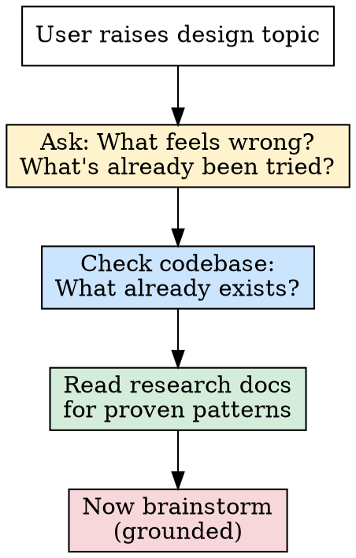
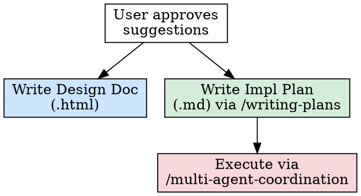

# Sector Design Brainstorming

## Overview

A framework for turning game design ideas into pillar-aligned, research-grounded, fun-tested feature proposals for Sector.

**Core principle:** Every suggestion must pass three filters — pillar alignment, proven pattern evidence, and the fun-vs-tedious test. Ungrounded creative brainstorming produces plausible ideas that don't survive contact with players.

## Before Suggesting Anything



**This order is mandatory.** Jumping to suggestions without steps 1-3 produces generic game design advice.

### Step 1: Cooperative Inquiry

Ask the user before suggesting. Minimum questions:
- What specifically feels wrong or boring? (The diagnosis shapes the cure)
- What have you already tried or considered?
- Is the issue the *activity itself* or the *lack of stakes*?

### Step 2: Check What Exists

Search the codebase for relevant systems. Many "wouldn't it be cool if" features already exist in some form:
- `Sector.Engine/Mining/` — MiningManager, LaserHeatAccumulator, ClaimEncounterHandler, prospecting
- `Sector.Engine/Crew/` — Psychology, Relationships, Skills, Traits, Memory, Nemesis
- `Sector.Engine/Events/` — Storylets, PersonalEvents, Situations, Signals
- `Sector.Engine/Ship/` — Faults, Layout, FaultDiagnostics, Certifications
- `Sector.Engine/World/` — Economy, Factions, Politics, A-Life simulation

### Step 3: Read the Research

Two research documents contain proven patterns from comparable games:

- `docs/design/2026-02-25-fun-mechanics-research.md` — Mechanics from XCOM, Wildermyth, RimWorld, Darkest Dungeon, Mass Effect, Dwarf Fortress, CK3, Shadow of Mordor, Kenshi, Caves of Qud, Starsector. Includes the Attachment Formula and Emergent Narrative Formula.
- `docs/plans/2026-03-14-game-loop-research.md` — Deep loop analysis of 10 games plus 6 thematic categories. Includes 8 Cross-Cutting Patterns.

**Always cite which game proved the pattern you're suggesting.** "RimWorld proves that autonomous colonist behavior creates better stories than scripted events" is better than "NPCs should act on their own."

## The Three Filters

Every suggestion must pass all three. Apply them explicitly.

### Filter 1: Pillar Alignment

Score each suggestion against the 8 pillars (priority order):

| # | Pillar | Question |
|---|--------|----------|
| 1 | Crew permanence | Does this make crew more valuable/irreplaceable? |
| 2 | Characters as individuals | Does this make crew feel like people, not stat blocks? |
| 3 | Moral grey | Does this create decisions without clear right answers? |
| 4 | World acts without you | Does this happen whether or not the player engages? |
| 5 | Politics is gameplay | Does this connect to factions, leverage, reputation? |
| 6 | Boarding as operation | Does this involve tactical crew-level action? |
| 7 | Ship as machine | Does this make the ship feel like a system that breaks/degrades? |
| 8 | Desperation before power | Does this make early game scrappy and rewarding? |

**A suggestion that scores on pillars 1-3 is higher priority than one scoring on pillars 6-8.** Pillar order IS priority order.

### Filter 2: Proven Pattern Evidence

The research identifies 8 cross-cutting patterns. Tag each suggestion with which pattern(s) it uses:

| Pattern | Core Insight | Example Game |
|---------|-------------|-------------|
| **Scar System** | Permanent marks become story elements, not punishments | Darkest Dungeon quirks, Kenshi lost limbs |
| **Loss of Agency** | Removing player control at the right moment creates memorable stories | DD afflictions, RimWorld mental breaks |
| **Social Debt Economy** | Obligations between actors as gameplay currency | CK3 hooks, Caves of Qud water ritual |
| **Two Accounts** | Multiple interpretive layers for the same events generate intrigue | CK3 secrets vs public knowledge |
| **Geopolitical Archaeology** | Discovering past effects of your own actions | Starsector colony crises, Kenshi world state |
| **Retirement/Legacy** | Ending a character's story is a victory, not just avoiding death | Heat Signature retirement weapons |
| **Desperation Ratchet** | Accumulating pressure with no pause button | FTL sectors, Sunless Sea fuel/food/terror |
| **Secrets as Weapons** | Knowledge asymmetry is power | CK3 hooks, information as leverage |

**A suggestion backed by a proven pattern with a cited game is stronger than an untested idea.** If you can't point to a game that proved the pattern works, flag it as experimental.

### Filter 3: Fun vs. Tedious Test

From the research, mechanics land on a spectrum:

**Fun mechanics share:**
- Variety of outcomes (not binary good/bad)
- Player agency in *prevention*, not *cure*
- Positive possibility amid negative pressure (~25% virtue chance)
- Narrative integration (creates story events, not just debuffs)
- Character-specific responses (different people react differently)

**Tedious mechanics share:**
- Binary outcome (stressed or not stressed)
- Obvious optimal solution ("just send them to the bar")
- Management overhead without interesting decisions
- Punishment without story (debuff applied, no narrative event)
- Frequency mismatch (too frequent = chore, too rare = forgettable)

**Apply this test explicitly:** "This suggestion could become tedious if [specific risk]. To keep it fun, [specific mitigation]."

## The Attachment Formula

From the research, player attachment follows:

```
Attachment = Customization + Time Investment + Visible History + Risk of Loss + Autonomous Personality
```

When evaluating crew/character features, check which components the suggestion strengthens. A feature that adds Visible History (scars, traits, memories that other crew reference) is higher value than one that adds a hidden stat bonus.

## The Emergent Narrative Formula

```
Emergent Narrative = Systemic Depth + Character Autonomy + Consequential History + World Independence
```

When evaluating world/sandbox features, check which components the suggestion strengthens. Features that increase Character Autonomy (crew acting on their own opinions) score higher than features that add more player-controlled options.

## Output Format

For each suggestion, present:

```
### [Feature Name]
**Pillar alignment:** [which pillars, scored 1-8]
**Proven pattern:** [which pattern + which game proved it]
**Fun/tedious risk:** [specific risk + mitigation]
**Existing systems it builds on:** [what's already in codebase]
**Scope:** [small/medium/large — relative implementation effort]
```

Limit to **3 suggestions max** per brainstorming round. Focus beats volume. The user can ask for more.

## After Brainstorming: Deliverables

Once the user approves suggestions, the skill produces two artifacts and routes to execution.



### Design Document (HTML)

Write to `docs/design/[feature-name]-design.html`. This is the creative artifact — readable by non-engineers, shareable, visual.

**Structure:**
```html
<!DOCTYPE html>
<html><head>
  <title>[Feature] — Sector Design Document</title>
  <style>/* clean readable style, dark theme matching game aesthetic */</style>
</head><body>
  <h1>[Feature Name]</h1>
  <section id="vision"><!-- 2-3 sentences: what this feels like to play --></section>
  <section id="pillars"><!-- which pillars, why this matters --></section>
  <section id="proven-patterns"><!-- research evidence with game citations --></section>
  <section id="mechanics"><!-- specific mechanics, interactions, edge cases --></section>
  <section id="player-stories"><!-- 2-3 example "stories players will tell" --></section>
  <section id="fun-tedious"><!-- risks and mitigations --></section>
  <section id="existing-systems"><!-- what's already built, what connects --></section>
  <section id="scope"><!-- rough effort estimate --></section>
</body></html>
```

**Key rules:**
- "Player stories" section is mandatory — if you can't write 2 concrete stories players would tell, the feature isn't grounded enough
- Cite specific games in the "proven patterns" section with links to research docs
- Include the pillar alignment table from the brainstorming output

### Implementation Plan (Markdown)

**REQUIRED SUB-SKILL:** Use `superpowers:writing-plans` to generate the implementation plan.

Write to `.planning/[feature-name]-plan.md`. This is the engineering artifact — concrete tasks, dependencies, files to modify, test strategy.

The writing-plans skill handles structure. Feed it:
- The approved suggestion(s) from brainstorming
- The "existing systems it builds on" list (already identified in brainstorming)
- The scope estimate
- Which engine files need modification vs. new files

### Execution

**REQUIRED SUB-SKILL:** Use `multi-agent-coordination` to execute the plan.

The implementation plan from writing-plans produces discrete tasks. Route these to parallel agents via multi-agent-coordination:
- Engine tasks (pure C# simulation) can run in parallel with presentation tasks (MonoGame)
- Test writing can run in parallel with implementation (TDD via `superpowers:test-driven-development`)
- Event definitions (`.eventdef` files) can be authored in parallel with engine handlers

## Red Flags — You're Brainstorming Wrong

| Symptom | Fix |
|---------|-----|
| Suggesting 5+ features at once | Cut to top 3. Focus beats volume. |
| No game cited as evidence | Read the research docs. Ground every suggestion. |
| "Wouldn't it be cool if..." | Cool is not a filter. Pillar-aligned + proven + fun-tested is. |
| Duplicating existing systems | Check codebase first. Enhance what exists. |
| Suggesting without asking first | Step 1 is cooperative inquiry. Always. |
| Feature sounds fun for the designer, not the player | Apply the tedious test. Would managing this be a chore? |
| Adding complexity instead of depth | Depth = interesting decisions. Complexity = more things to track. |
| Ignoring pillar priority | A Pillar 1-2 feature beats a Pillar 7-8 feature. Always. |

## Quick Reference: Research Doc Locations

| Document | Path | Best For |
|----------|------|----------|
| Fun Mechanics Research | `docs/design/2026-02-25-fun-mechanics-research.md` | Attachment formula, pillar-aligned mechanics, recommendations |
| Game Loop Research | `docs/plans/2026-03-14-game-loop-research.md` | Cross-cutting patterns, loop structures, thematic mechanics |
| Design Pillars | `docs/design/PILLARS.md` | Canonical pillar definitions and priority order |
| Game Design Doc | `docs/design/GDD.md` | Full game vision, system descriptions, content plans |
