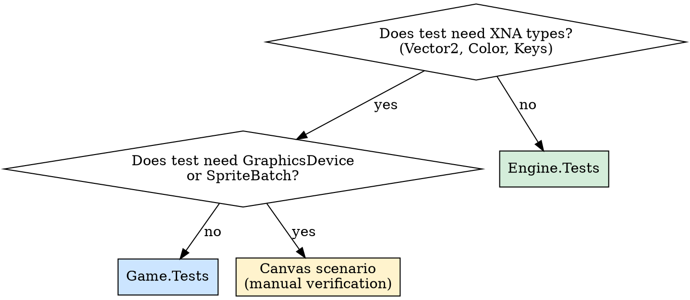

# Sector Integration Testing

## Overview

Sector has three testing tiers. Picking the wrong tier wastes time or makes tests impossible. This skill tells you which tier to use and which existing helpers to leverage.

**Core principle:** Test everything headlessly. MonoGame has no official headless runtime — but Sector's Engine/App separation means nearly all game logic is testable without a `GraphicsDevice`.

## Tier Selection



| Tier | Project | References | Can Use | Cannot Use |
|------|---------|-----------|---------|------------|
| **Engine** | `tests/Sector.Engine.Tests/` | `Sector.Engine` only | EventBus, MiningManager, Market, Ship, Crew | Vector2, Color, Keys, any XNA type |
| **Presentation** | `tests/Sector.Game.Tests/` | Full `Sector` project | Everything above + OreChunkActor, MiningInputHandler, InputSnapshot, Obstacle | GraphicsDevice, SpriteBatch, ContentManager, Texture2D |
| **Visual** | `Sector/Screens/Canvas/` | Full game runtime | Everything — real rendering | Automated assertions (human verifies) |

**Rule:** If the class under test lives in `Sector.Engine/`, use Engine.Tests. If it lives in `Sector/App/`, use Game.Tests. If it needs rendering, add a Canvas scenario.

## Required Patterns

### EventBus Isolation (MANDATORY)

Every integration test MUST clear static EventBus state. Omitting this causes cross-test pollution.

```csharp
[SetUp]
public void SetUp() {
  EventBus.ClearAll();
}

[TearDown]
public void TearDown() {
  EventBus.ClearAll();
}
```

### Use EventCapture<T> (NOT hand-rolled lists)

`EventCapture<T>` auto-subscribes on construction and auto-unsubscribes on dispose. Located at `tests/Sector.Engine.Tests/TestUtilities/Fixtures/EventCapture.cs`.

```csharp
// WRONG - hand-rolled
List<CargoFullEvent> events = new List<CargoFullEvent>();
EventBus.Subscribe<CargoFullEvent>(e => events.Add(e));
// ... must manually unsubscribe in TearDown

// RIGHT - use EventCapture
using EventCapture<CargoFullEvent> capture = new();
manager.ResolveOreChunkCollected(...);
capture.AssertEventFired("CargoFullEvent should fire");
Assert.That(capture.First().AttemptedOreType, Is.EqualTo(GoodsType.IronOre));
```

**API:** `AssertEventFired()`, `AssertNoEvents()`, `AssertEventCount(n)`, `First()`, `Last()`, `Events` (IReadOnlyList).

**Exception — cross-type event ordering:** When testing that EventA fires before EventB, you need a shared `List<string>` + `Subscribe` since EventCapture only tracks one event type. This is the ONE case where hand-rolled subscription is acceptable:

```csharp
List<string> order = new List<string>();
EventBus.Subscribe<ClaimBeaconPlacedEvent>(_ => order.Add("placed"));
EventBus.Subscribe<ClaimStatusChangedEvent>(_ => order.Add("status_changed"));
// ... trigger action ...
Assert.That(order[0], Is.EqualTo("placed"));
```

### Use TestFixtures Factories

`tests/Sector.Engine.Tests/TestFixtures.cs` provides deterministic builders. Use them instead of ad-hoc construction:

- `TestFixtures.CreateSeededRandom(seed)` — deterministic Random
- `TestFixtures.CreateDefaultSkills()` / `CreateDefaultAptitudes()`
- `TestFixtures.CreateTestFaction()` / `CreateTestContact(tier, factionId)`
- `TestFixtures.CreateTestWound(type, severity, location)`
- `TestFixtures.CreateTestPatrolContext(heat, hasContraband)`

### Deterministic Seeding

All randomized systems accept a seed parameter. Always seed in tests:

```csharp
MiningManager manager = new MiningManager(seed: 42);
LaserHeatAccumulator heat = new LaserHeatAccumulator(rng: new Random(42));
OreChunkManager chunks = new OreChunkManager(new Random(42));
```

### Market Setup

Market requires `MarketId` and `StationId` — don't use bare `new Market()`:

```csharp
Market market = new Market {
  MarketId = EntityId.New(),
  StationId = EntityId.New(),
  TaxRate = 0f
};
market.Listings.Add(new MarketListing {
  GoodsType = GoodsType.IronOre,
  Category = GoodsCategory.RawMaterials,
  Quantity = 0,
  MaxQuantity = 400,
  BasePrice = 30f
});
```

## Test Naming Convention

`MethodUnderTest_Condition_ExpectedResult` (PascalCase with underscores separating clauses):

```
ResolveMiningLaserFired_ExhaustedField_PublishesNoChunks
TickLaserActive_StressAccumulatorExceeds30Seconds_AppliesStressToCrew
FullMiningLoop_LaserFireThenCollect_CargoContainsExpectedOre
```

## Engine Integration Test Patterns

See `examples/engine-mining-loop.cs` for a complete example.

**Key patterns for engine integration:**
- Compose real managers (MiningManager, CharacterSimulationManager, ShipLayout)
- Drive events through the pipeline, not individual methods
- Verify downstream effects via EventCapture
- Test the chain: laser fired -> chunks spawned -> collected -> cargo -> market sell price

**Existing examples to study:**
- `tests/Sector.Engine.Tests/Integration/MVPPlaySessionTests.cs` — full game flow simulation
- `tests/Sector.Engine.Tests/Integration/BootstrapIntegrationTests.cs` — world init verification
- `tests/Sector.Engine.Tests/World/Economy/OreEconomyIntegrationTests.cs` — market economics

## Presentation Integration Test Patterns (Game.Tests)

See `examples/presentation-mining-flow.cs` for a complete example.

**What can be tested without GraphicsDevice:**
- `OreChunkManager` — Spawn(), Update(), collection detection (uses Vector2, no rendering)
- `MiningInputHandler` — edge/hold input state (pure logic)
- `LaserHeatAccumulator` — heat/cooldown/overheat cycle (pure math)
- `OreChunkActor` — DisplayScale, Alpha, GlintFlashActive (computed properties)
- `Obstacle` — SectorPosition, DriftVelocity (data class with Vector2)
- Any `HandleInput(InputSnapshot)` method on screens (via TestSupport)

**What CANNOT be tested (use Canvas scenarios):**
- SpriteBatch.Draw calls, shader effects, render targets
- Anything requiring a live GraphicsDevice or ContentManager
- Visual correctness (overlap, z-ordering, color)

### TestSupport Helpers (Game.Tests / excluded Engine.Tests/MonoGame/)

Located at `tests/Sector.Engine.Tests/MonoGame/TestSupport.cs` (excluded from Engine.Tests compilation, included in Game.Tests via project reference):

```csharp
// Create InputSnapshot with specific keys pressed (reflection-based)
InputSnapshot input = TestSupport.CreateInputSnapshot(Keys.Space, Keys.LeftShift);

// With previous frame keys (for edge detection)
InputSnapshot input = TestSupport.CreateInputSnapshot(
  currentKeys: new[] { Keys.Space },
  previousKeys: new[] { Keys.Space }  // held, not pressed
);

// Read private fields for state verification
int scrollOffset = TestSupport.GetPrivateField<int>(overlay, "_scrollOffset");
```

### MonoGameTestBootstrap

`[SetUpFixture]` that initializes static DrawPrimitives cell dimensions via reflection. Required when testing anything that calls `DrawPrimitives.CellSize()`.

## Excluded MonoGame/ Directory

`tests/Sector.Engine.Tests/MonoGame/` contains tests that use XNA types but live in the Engine.Tests project tree. They are **excluded from Engine.Tests compilation** by csproj:

```xml
<Compile Remove="MonoGame\**\*.cs" />
```

These tests reference `Sector` (not just `Sector.Engine`) and test screens, overlays, and rendering utilities. They exist as a secondary location for MonoGame-aware tests that don't need GraphicsDevice.

**For new presentation tests, prefer `Game.Tests`** — it's the canonical project for MonoGame-dependent tests.

## Canvas Scenarios (Visual Verification)

When a feature needs visual/interaction verification, add a Canvas scenario. See `Sector/Screens/Canvas/Scenarios/` for 20 existing examples.

```csharp
public sealed class MyScenario : ICanvasScenario {
  public string Name => "My Feature";
  public string Description => "Tests X in isolation.";
  public string Category => "Mining";
  public SessionState BuildSession() {
    return CanvasBootstrapper.BuildMinimalSession(
      new NodeSpec("Field", NodeType.AsteroidField, 0f, 0f, "Belter Coalition", false),
      new NodeSpec("Depot", NodeType.Station, 2f, 0f, "Belter Coalition", true));
  }
  public SceneContainer CreateScene(SessionState session, InputBindings bindings) {
    return new PilotingScene(bindings);
  }
}
```

Register in `ScenarioRegistry.All()`. Tell user: "Launch Project Canvas -> [Scenario Name] to verify."

## Common Mistakes

| Mistake | Fix |
|---------|-----|
| Forget `EventBus.ClearAll()` in SetUp/TearDown | Tests randomly fail from prior test state pollution |
| Hand-roll `List<T>` + `Subscribe` for events | Use `EventCapture<T>` — auto-cleanup via IDisposable |
| Use `new Market()` without MarketId/StationId | Always set `MarketId = EntityId.New()`, `StationId = EntityId.New()` |
| Put presentation tests in Engine.Tests | Engine.Tests can't reference XNA types — use Game.Tests |
| Try to create GraphicsDevice in tests | You don't need one. Test logic/physics/state, not rendering |
| Use `var` in test code | Project enforces explicit types (`csharp_style_var_*: false:error`) |
| Non-deterministic tests (no seed) | Always pass `seed:` or `rng:` parameter to randomized systems |
| Test naming without underscores | Use `Method_Condition_Expected` convention (PascalCase) |
