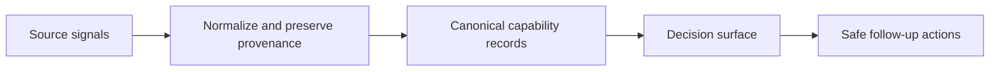
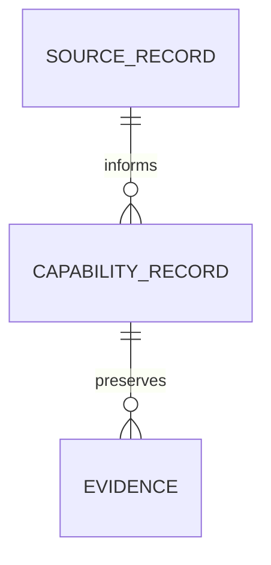

# Generative Feature Remediation

Transform a backlog, review report, feedback corpus, or rough product request into a **durable, creative feature concept** rather than a collection of local patches.

This is the generative counterpart to `adversarial-remediation`: preserve its rigor about evidence, coverage, root causes, and sequencing, but use the findings as raw material for a reusable capability that solves the present case and reduces future classes of problems.

## Use this when

- The user asks to make a surface substantially better, clearer, sharper, more useful, or more forward-looking.
- A ticket list, review report, or feedback corpus needs to become a product or architecture proposal.
- The desired outcome includes a durable feature foundation, a new workflow, better analytics, visual redesign, or extensibility.
- The user asks for a rich report, proposal, redesign, feature concept, or Mermaid diagrams.
- The request sounds like: “do not patch this; establish a better feature,” “take all the tickets into consideration,” or “make this solve future issues too.”

Do not use this for a narrow bug fix, a purely adversarial critique, or an implementation request whose design is already settled. Use `adversarial-remediation` when the user wants only the critique or a grounded fix path for known findings.

## Core stance

The unit of work is not the ticket, comment, or visual request. The unit of work is the **capability** that makes several current issues disappear and creates a stable place for future behavior.

Keep these boundaries explicit:

1. **Evidence versus proposal.** State what the repository, supplied artifacts, or corpus proves and what the design introduces.
2. **Source facts versus workflow state.** Source refresh may update evidence; it must not silently overwrite ownership, lifecycle, or decisions.
3. **Canonical records versus projections.** A UI, report, or static export is not the source of truth unless the system explicitly makes it so.
4. **Current delivery versus future capability.** Design the durable seam now, but sequence expensive integrations honestly.
5. **Original items versus normalized items.** Deduplicate or reconcile repeated inputs only with an explicit mapping; never erase contradictory source wording.

### Reuse-first ethos

Honor the spirit of the existing system by reusing as much of it as possible. Before inventing a new model, component, service, interaction, visual primitive, naming convention, or workflow, search for the closest existing one and understand why it works.

Prefer, in order:

1. reuse unchanged;
2. compose existing pieces;
3. extend an existing contract;
4. introduce a new primitive only when the existing seam genuinely cannot express the capability.

The report must include a short **reuse inventory**: what was reused, what was deliberately extended, what is new, and why. Do not force reuse that would distort the product; explain the smallest clean seam instead. This is a creative feature-design skill, not a generic infrastructure, security, migration, or operations checklist. Inspect those concerns only when the issue is specifically about them.

The first paragraph of the final report should state the central shift in one sentence, for example: “Move from an observation browser to a lineage-preserving decision surface.”

## Workflow

### 1. Frame the request without shrinking it

Extract the user’s desired qualities and implied acceptance criteria:

- visual direction: sharp, dark, calm, dense, playful, editorial, or otherwise;
- functional direction: filtering, prioritization, collaboration, automation, or discovery;
- evidence scope: every ticket, review finding, source record, or signal;
- affected users and product constraints;
- future-facing ambition: what should become easier to add later;
- deliverable: design report, implementation, prototype, or staged plan.

If ambiguity creates materially different product or architectural choices, ask a focused question. Otherwise choose the conservative, repository-consistent default and state the assumption. Do not silently reduce “take all the tickets into consideration” to the loudest few. Create a coverage ledger before proposing the design.

### 2. Inventory the evidence and reusable material

Read the target artifact and repository conventions before designing. For a codebase, inspect:

- current data structures, identifiers, state machines, and persistence;
- current rendering and interaction paths;
- sibling features with similar filtering, provenance, analytics, or lifecycle behavior;
- existing design-system primitives and accessibility patterns;
- generated artifacts and ownership boundaries;
- tests or smoke paths that define observable behavior;
- the closest reusable models, services, components, layouts, serializers, and visual patterns.

For a non-code request or a repository that is unavailable, treat only the supplied artifacts and explicitly retrieved sources as evidence. State the evidence boundary instead of inventing precedent or current behavior.

Use parallel, facet-specific investigations when the surface is broad. Typical facets are domain/data, workflow/state, existing UI patterns, visual language, analytics, and integrations. Require file-and-line citations from investigators. Do not inspect infrastructure, permissions, security, migrations, or rollout mechanics unless the issue itself is about those concerns.

Record uncertainty explicitly. A source that is unavailable, stale, or unlinkable is still evidence about the system, but it is not proof of a current behavior.

### 3. Build the coverage ledger

First normalize the corpus without destroying source fidelity. Preserve each original item, assign a stable local reference when the source lacks one, and record duplicate or contradiction mappings explicitly.

For every input item, record:

- its stable label or identifier and original source reference;
- the observed symptom, request, or constraint;
- the underlying user or system consequence;
- the proposed capability group;
- whether it is directly solved, preserved as evidence, or intentionally sequenced later;
- the repository or artifact evidence supporting the diagnosis;
- unresolved ambiguity, contradiction, or dependency.

Every item must land in exactly one primary group. It may appear as supporting evidence elsewhere, but no item may disappear inside a broad theme such as “miscellaneous,” “polish,” or “other.” If the design intentionally does not address an item, name it and explain why. If two items conflict, preserve both and make the decision rule visible.

### 4. Collapse symptoms into opportunity areas

Do not group by file, team, severity, or ticket order. Name each group as a sentence describing the shared missing capability, such as:

- “The system has no canonical identity across source and workflow records.”
- “Users can browse signals but cannot form or scope a decision.”
- “Lifecycle transitions are implicit, so automation and analytics cannot be trusted.”

For each opportunity area, state:

1. the items it absorbs;
2. the current failure or limitation;
3. the affected users and product consequence;
4. the future capability that dissolves the limitation;
5. what existing code or product precedent makes the move idiomatic;
6. what becomes deletable or unnecessary after the capability exists.

Apply the **dissolution test**: prefer designs that make a class of issue stop existing over designs that add another guard, label, or special case.

### 5. Define the durable feature foundation

Design the smallest coherent domain contract that can support both today’s surface and plausible future extensions. Usually make these explicit:

- stable IDs for every canonical record;
- immutable or append-only source evidence when history matters;
- explicit relationships instead of positional arrays or inferred joins;
- canonical workflow state and valid transitions;
- ownership, priority, and decision fields where the user needs them;
- idempotent reconciliation or refresh semantics when sources recur;
- provenance, source keys, timestamps, and optional external links;
- extension points for new source types, themes, actions, or visualizations.

When proposing a model, explain what is authoritative, what is derived, and what is merely a projection. Do not introduce a new abstraction when an existing model, service, state machine, or serializer already expresses the contract. Define how invalid, stale, conflicting, deleted, and partially represented records behave only when those states matter to the requested feature.

For a genuinely new product or infrastructure addition, include a focused ERD and/or architecture visualization that makes the new records, relationships, or boundaries concrete. Do not expand this into a general architecture review unless the request requires it.

### 6. Design the interaction model

Turn the capability into a workflow, not a screen decoration. Describe:

- the primary record or object users act on;
- the secondary evidence or detail view;
- creation, triage, planning, execution, validation, resolution, and reopening behavior as applicable;
- filtering semantics: normally OR within a dimension and AND across dimensions;
- empty, loading, error, archived, blocked, and stale-source states;
- keyboard, screen-reader, reduced-motion, zoom, and focus behavior;
- what can be acted on safely and what must remain read-only when that distinction matters.

For a dense analytical surface, prefer bordered controls, explicit labels, aligned columns, and clear hierarchy. A dark theme is a palette choice, not a substitute for contrast or structure. If the user asks for a sharp look, use square or near-square geometry, restrained color, and borders or rules rather than decorative rounded hierarchy. Pills are acceptable only when they encode a compact semantic state and remain text-readable.

### 7. Design the creative surface

Make the visual direction concrete enough to build and consistent enough to reuse:

- establish hierarchy before decoration;
- choose a small palette with semantic roles rather than one color per concept;
- define density, spacing, typography, borders, focus, empty states, and responsive behavior;
- make the primary action and current scope obvious;
- use dark mode only when it serves the surface, with readable contrast and visible structure;
- prefer existing product marks, primitives, and layout conventions before inventing a new visual language.

The design should feel intentional and distinctive, but every visual choice must help comprehension, navigation, or action.

### 8. Design analytics from decisions backward

Do not add charts because the request says “better visualizations.” For every visualization, state:

- the decision or question it supports;
- the population and active scope it aggregates;
- the unit, time window, and denominator;
- the interaction with filters and detail views;
- the textual equivalent for accessibility;
- the failure behavior when data is sparse, stale, conflicting, or incomplete.

A strong default analytical set is:

- volume over time;
- composition by lifecycle or priority;
- a source/theme/owner matrix for concentration;
- an evidence or lifecycle timeline when timestamps are reliable;
- a table or list that remains useful without the charts.

Prefer existing CSS, SVG, semantic tables, and chart primitives over adding a dependency without a clear need. Every chart must be explainable in one sentence, share scope semantics with the underlying list, and omit or qualify data when it cannot support the implied precision.

### 9. Use focused diagrams to expose the proposal

Use Mermaid sparingly and purposefully. Include only the diagrams needed to clarify the addition:

- an ERD for new canonical records and relationships;
- a source-to-canonical-record-to-surface flow;
- a lifecycle state diagram when state transitions are central;
- optionally, a focused architecture boundary for a new integration.

Keep diagrams readable, avoid giant architecture maps, and use explicit node labels. If Mermaid is rendered in the product, follow the repository’s rendering conventions; if it is only in a report, ensure the source is valid and copyable. Do not place secrets or uncontrolled user text into a rendered diagram.

Useful shapes include:

### 10. Sequence the work honestly

Recommend one sequence, not a menu of alternatives. Split it into:

- **Reuse and extension foundation:** identify the pieces to keep, the smallest new seam, canonical identity/relationships if needed, and the minimum state or data contract.
- **Surface / first release:** primary workflow, detail/evidence view, visual system, scoped analytics, and accessibility.
- **Follow-up:** integrations, automation, advanced analytics, and optional polish.

Give a reason for each boundary: reuse leverage, user value, design coherence, reviewability, or dependency order. State the strongest rejected alternative and why it is not the recommended path. Do not inflate a creative feature design into an unbounded platform or operations rewrite.

### 11. Produce the report

Write prose with strong headings rather than a ticket-shaped table. The report should contain:

1. **Feature thesis** — the central shift and why it matters.
2. **Executive summary** — what changes for users and the system.
3. **Evidence and coverage** — what was inspected, the evidence boundary, and how every input item is accounted for.
4. **Reuse inventory** — what is reused, composed, extended, or newly introduced, with reasons.
5. **Opportunity areas** — grouped causes/missing capabilities, each with repository precedent.
6. **Canonical foundation** — records, relationships, state, provenance, authority, and refresh semantics where relevant.
7. **Interaction model** — primary workflow, filters, evidence, states, and accessibility.
8. **Visual system** — geometry, palette, hierarchy, typography, density, and dark-mode behavior.
9. **Analytics contract** — decisions, charts, scope, and text equivalents.
10. **ERD and architecture diagrams** — only for genuinely new additions or boundaries that need explanation.
11. **Delivery sequence** — reuse/extension foundation, first release, and follow-up.
12. **Acceptance criteria** — observable behavior, not implementation details.
13. **Risks, disagreements, and out of scope** — the concern the proposal creates, the strongest rejected alternative, and what is intentionally not being designed.

Close by distinguishing verified repository or source facts from proposed design decisions and assumptions.

## Quality gates

Before delivering, perform a short self-critique and fix the identified omissions. Verify:

- No input ticket, finding, constraint, duplicate, or contradiction was silently dropped.
- The design solves at least one future class of issue, not only current wording.
- Every major design claim has either repository/source evidence or an explicit “new convention” label.
- Existing models, components, services, patterns, and visual primitives were searched before new ones were proposed.
- The reuse inventory explains every meaningful new abstraction.
- Canonical records have stable identity and explicit relationships when new data is introduced.
- Filtering, counts, and charts share one defined scope.
- The primary workflow works without relying on color, hover, or chart geometry.
- Dark mode has adequate contrast and does not hide borders or focus states when used.
- ERD and architecture diagrams are focused, syntactically valid, and useful without narration when the feature adds new structure.
- Acceptance criteria describe what a user or system observer can verify.
- The proposal names what is intentionally not in the first release.
- Infrastructure, security, migration, and operations detail has not been added merely because it is generally possible; it appears only when central to the issue.

## Failure modes

- **Patch theater:** adding badges, guards, or special cases without changing the missing capability.
- **Ticket amnesia:** selecting a few compelling items and losing the rest of the corpus.
- **Silent conflation:** deduplicating contradictory or differently scoped inputs without preserving their source references.
- **Novelty bias:** inventing new models, components, or visual systems before searching for reusable existing ones.
- **Visual garnish:** adding dark colors, rounded cards, or charts without improving decisions.
- **Dashboard numerology:** presenting counts without population, scope, denominator, or action.
- **Canonical ambiguity:** allowing source facts, derived summaries, and workflow state to disagree.
- **Positional or implicit relationships:** using array order, display order, or text matching as identity.
- **Feature soup:** listing every possible integration without a coherent primary workflow.
- **Diagram theater:** producing Mermaid that restates prose instead of exposing a new record, boundary, or transition.
- **Prescriptive scope creep:** turning a creative feature request into an unsolicited infrastructure, security, migration, or operations review.
- **Unbounded rewrite:** turning a design request into a platform migration without sequencing or user approval.
- **Unverified precedent:** claiming a repository convention without reading the implementation.
- **Premature implementation:** editing code before the user has chosen the capability shape when the request is explicitly for a report or proposal.
