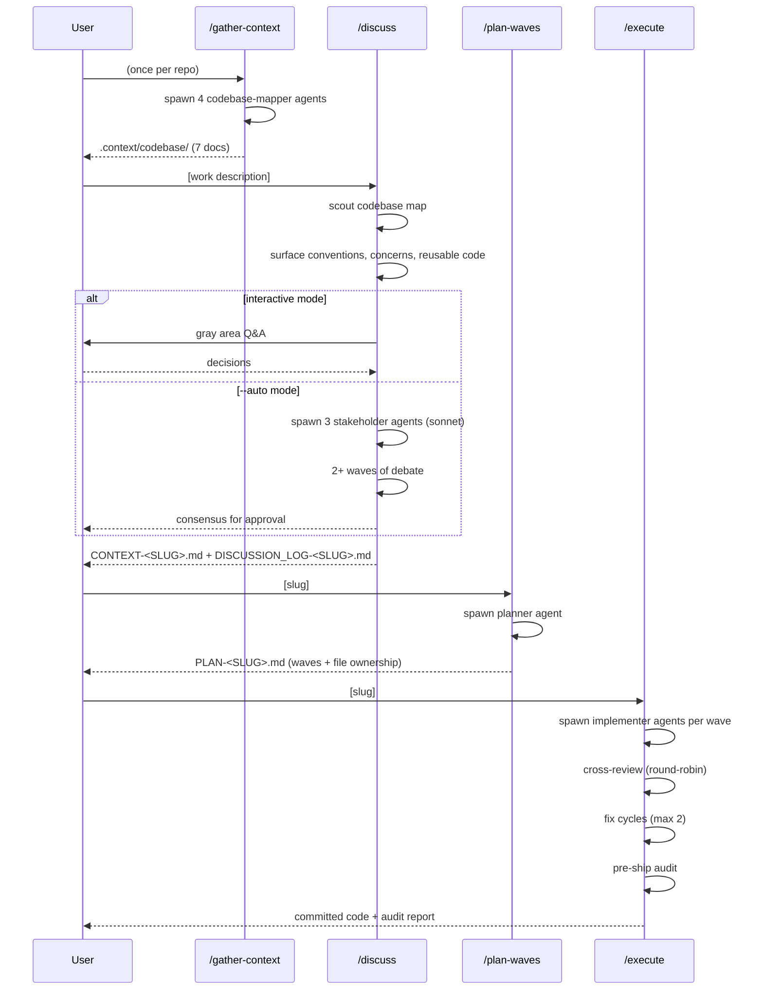
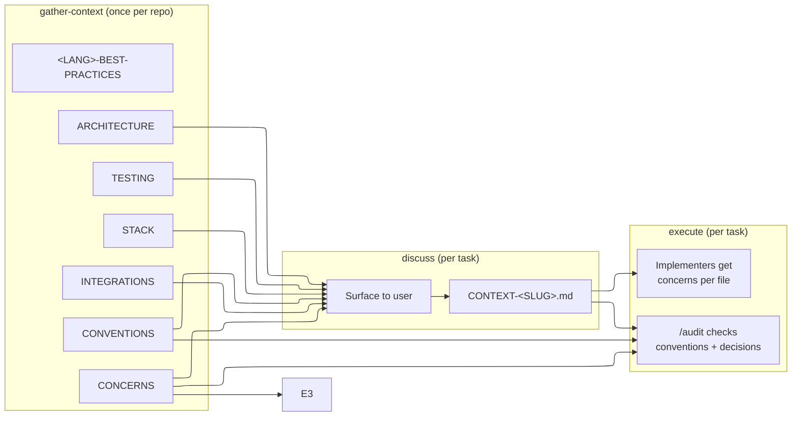

# discuss-and-execute

Discuss implementation decisions, then execute with parallel agents in coordinated waves.

**Core principle: surface early, save time.** Spend 20 minutes capturing conventions, concerns, and decisions before coding starts. This prevents hours of rework when reviewers say "we don't do it that way here" or "did you know there's already a helper for that?"

## Quick Start

```bash
/gather-context                          # once per repo
/discuss add user auth with JWT          # interactive Q&A to lock decisions
/plan-waves auth                         # decompose into wave plan
/execute auth                            # dispatch agents, cross-review, audit, commit
```

Or fully automated:

```bash
/autopilot add user auth with JWT        # full pipeline, two human gates
/discuss --auto add user auth with JWT   # AI panel instead of Q&A
```

## Pipeline



## How Knowledge Flows

Each stage reads from the previous stage's output and from the cached codebase map. Nothing is lost between stages.



The pre-ship audit (execute Step 5) closes the loop: it checks the implementation against the same conventions and concerns that were surfaced in discuss.

## Skills Reference

| Skill                | What it produces                                 | Human input                |
| -------------------- | ------------------------------------------------ | -------------------------- |
| `/gather-context`    | `.context/codebase/` (7 docs)                    | None                       |
| `/discuss`           | `CONTEXT-<SLUG>.md` + `DISCUSSION_LOG-<SLUG>.md` | User makes decisions       |
| `/discuss --auto`    | Same output, AI panel instead of Q&A             | Review consensus           |
| `/plan-waves [slug]` | `PLAN-<SLUG>.md` with waves + file ownership     | Approve/revise             |
| `/execute [slug]`    | Committed code + audit report                    | Only on blockers           |
| `/autopilot [work]`  | All of the above, end-to-end                     | Work description + 2 gates |

### /gather-context

Spawns 4 parallel `codebase-mapper` agents, each analyzing a focus area:

| Agent | Focus    | Output                            |
| ----- | -------- | --------------------------------- |
| 1     | tech     | `STACK.md`, `INTEGRATIONS.md`     |
| 2     | arch     | `ARCHITECTURE.md`, `STRUCTURE.md` |
| 3     | quality  | `CONVENTIONS.md`, `TESTING.md`    |
| 4     | concerns | `CONCERNS.md`                     |

Run once per repo. Refresh when the codebase changes significantly.

### /discuss

Two modes, same output:

- **Interactive (default):** Scouts codebase map, surfaces relevant conventions/concerns/reusable code, then guides user through gray area Q&A. 10 steps.
- **Auto (`--auto`):** Same scouting, but spawns 3 AI stakeholders (sonnet) with distinct technical perspectives who debate across 2+ waves until consensus.

The SKILL.md is a mode router — it reads `$CLAUDE_PLUGIN_ROOT/skills/discuss/references/interactive-mode.md` or `auto-mode.md` based on the `--auto` flag.

### /plan-waves

Reads CONTEXT + codebase map (including CONVENTIONS.md, CONCERNS.md, TESTING.md). Spawns a `planner` agent that decomposes into waves with:

- File ownership boundaries (no two tasks in the same wave touch the same file)
- Cross-wave handoff documentation
- Decision traceability (D-XX refs from CONTEXT)

### /execute

You become the team lead. For each wave:

1. Spawn `implementer` agents in parallel (each gets file ownership + relevant concerns)
2. Cross-review: round-robin peer review
3. Fix cycles (max 2 per wave)
4. Commit the wave
5. **Pre-ship audit** — checks convention compliance, concern avoidance, decision compliance, test coverage

### /autopilot

Orchestrates the full pipeline: gather-context (if needed) -> discuss --auto -> plan-waves -> execute. Human gates after panel consensus and after pre-ship audit.

## Agents Reference

| Agent             | Model  | Spawned by                             | Purpose                                                                                                 |
| ----------------- | ------ | -------------------------------------- | ------------------------------------------------------------------------------------------------------- |
| `codebase-mapper` | opus   | /gather-context                        | Explores a focus area, writes structured docs to `.context/codebase/` (run once per repo)               |
| `researcher`      | sonnet | /gather-context, /discuss, /plan-waves | Confidence-rated research: comparison, ecosystem, or feasibility mode. Persists to `.context/research/` |
| `planner`         | sonnet | /plan-waves                            | Decomposes CONTEXT into wave-structured PLAN with file ownership                                        |
| `implementer`     | sonnet | /execute                               | Implements within file ownership boundaries, cross-reviews peers                                        |

## Artifacts

```text
.context/
  codebase/                                # cached per repo
    CONVENTIONS.md
    CONCERNS.md
    TESTING.md
    ARCHITECTURE.md
    STRUCTURE.md
    STACK.md
    INTEGRATIONS.md
    <LANG>-BEST-PRACTICES.md               # one per language detected in STACK.md
  research/                                # persisted research results
    ecosystem-stack.md                     # from /gather-context
    ecosystem-pitfalls.md                  # from /gather-context
    <SLUG>-<TOPIC>.md                      # from /discuss or /plan-waves
    panel-<SLUG>-wave-<N>.md               # from /discuss --auto
  CONTEXT-<SLUG>.md                        # per task — locked decisions
  DISCUSSION_LOG-<SLUG>.md                 # per task — discussion transcript
  PLAN-<SLUG>.md                           # per task — wave plan with file ownership
```

## Plugin Structure

```text
discuss-and-execute/
  .claude-plugin/plugin.json
  AGENTS.md                            # this file
  CLAUDE.md                            # -> @AGENTS.md
  README.md                            # user-facing install + overview
  agents/
    codebase-mapper.md
    researcher.md
    planner.md
    implementer.md
  skills/
    gather-context/
      SKILL.md
      references/
        research-tech.md
        research-arch.md
        research-quality.md
        research-concerns.md
        research-best-practices.md
    discuss/
      SKILL.md                         # mode router only
      references/
        interactive-mode.md
        auto-mode.md
        discussion-patterns.md
        output-templates.md
    plan-waves/
      SKILL.md
      references/plan-template.md
    execute/
      SKILL.md                         # all-in-one: role, prompts, process, audit
    autopilot/
      SKILL.md
```

## Conventions for This Plugin

- **Skill bodies are routers.** Process logic lives in `references/` files, loaded via `$CLAUDE_PLUGIN_ROOT` on demand.
- **Descriptions follow progressive disclosure.** What it delivers + prerequisite + `<triggers>`. No process detail.
- **All artifacts are slugged.** Supports multiple runs per repo without clobbering.
- **Agents are sonnet by default**, opus for codebase-mapper only.
- **File ownership is strict.** Implementers may only modify files in their ownership list. Violations are caught in cross-review.

## Modifying This Plugin

1. Keep SKILL.md bodies under 80 lines — move process detail to `references/`
2. Run `/audit [skill] progressive disclosure` to verify layer compliance
3. Test `<triggers>` tags render correctly in system-reminder (char budget: ~500 per skill)
4. Check for trigger collisions with `superpowers` plugin (especially "plan", "execute")
5. Update this AGENTS.md when adding skills, agents, or changing the pipeline
