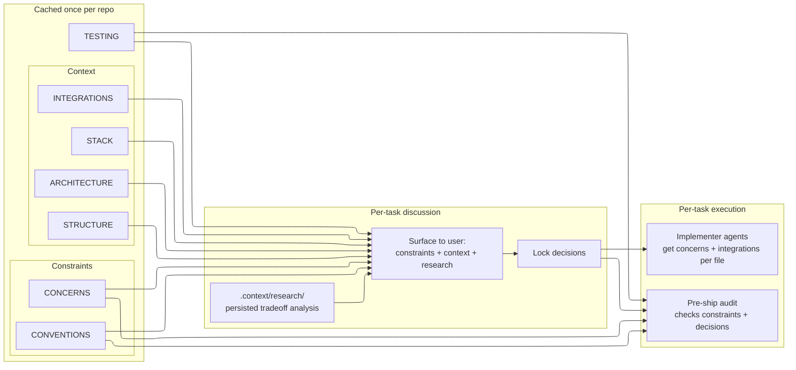

# discuss-and-execute

Discuss implementation decisions, then execute with parallel agents in coordinated waves. Surface conventions, concerns, and reusable code early — so agents build it right the first time.

```mermaid
---
config:
  layout: elk
---
flowchart LR
    START(["You have a task"]) --> HAS_MAP{".context/codebase/<br/>exists?"}

    HAS_MAP -->|No| GC["/gather-context<br/><i>2 researchers + 5 opus mappers</i>"]
    HAS_MAP -->|Yes| MODE
    GC --> MODE{"How do you want<br/>to work?"}

    subgraph DISCUSS_PHASE["Discuss"]
        MODE -->|"Step by step"| DISCUSS["/discuss<br/><i>Interactive Q&A</i>"]
        MODE -->|"Hands-off"| AUTO["/discuss --auto<br/><i>3 stakeholders debate</i>"]
        MODE -->|"Full autopilot"| AUTOPILOT["/autopilot"]
        DISCUSS --> CONTEXT["CONTEXT + DISCUSSION_LOG"]
        AUTO --> CONTEXT
        AUTOPILOT -.->|"delegates"| AUTO
    end

    CONTEXT --> RESEARCH["Pre-plan research"]
    RESEARCH --> PLAN["/plan-waves"]

    subgraph EXEC_PHASE["/execute — per wave"]
        IMPL["Spawn implementers"] --> POLL["Poll TaskList"]

        subgraph REVIEW_LOOP["Cross-Review"]
            REV["SendMessage reviews"] --> BLOCK{"Blockers?"}
            BLOCK -->|Yes| FIXMSG["SendMessage fixes"]
            FIXMSG --> REV
        end

        POLL --> REV
        BLOCK -->|No| COMMIT["Commit wave"]
    end

    PLAN --> IMPL
    AUTOPILOT -.->|"then"| PLAN

    COMMIT --> MORE{"More<br/>waves?"}
    MORE -->|Yes| IMPL
    MORE -->|No| AUDIT["/audit<br/>conventions, concerns,<br/>decisions, tests"]
    AUDIT -->|PASS| DONE(["Shipped"])
    AUDIT -->|FAIL| FIXAUDIT["Fix"] --> AUDIT

    style GC fill:#e8f4f8,stroke:#2196F3
    style DISCUSS_PHASE fill:#e8f5e9,stroke:#4CAF50
    style EXEC_PHASE fill:#fff3e0,stroke:#FF9800
    style REVIEW_LOOP fill:#fce4ec,stroke:#E91E63
    style DONE fill:#e8f5e9,stroke:#4CAF50,stroke-width:3px
```



## Install

Via the Guideline plugin marketplace, or directly:

```bash
claude --plugin-dir /path/to/discuss-and-execute
```

## Usage

```
/gather-context                          # once per repo — maps codebase (opus)
/discuss add user auth with JWT          # interactive Q&A to lock decisions
/discuss --auto add user auth with JWT   # or: AI panel debates instead
/plan-waves auth                         # decompose into wave plan
/execute auth                            # dispatch agents, audit, commit
/autopilot add user auth with JWT        # or: run everything end-to-end
```

## What gets surfaced

Every stage reads from `.context/codebase/` and passes knowledge forward — nothing discovered early is lost later.



See [AGENTS.md](AGENTS.md) for full pipeline documentation, agent reference, and architecture diagrams.
