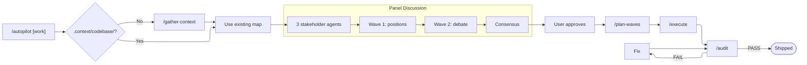

# Autopilot

Run the full pipeline front-to-back: gather context, panel discussion, plan waves, execute, audit.

Human approval is requested only at two gates: after the panel produces its recommendations, and after the pre-ship audit. Everything else runs automatically.



## Process

### Step 1: Gather Context (auto)

Check if `.context/codebase/` exists and is current.

- **If missing:** Run `/gather-context` automatically — spawn 4 mapper agents, write 7 docs, verify. No human approval needed.
- **If exists:** Use as-is. Print a one-liner: `Codebase map current — skipping gather-context.`

### Step 2: Scope the Work

If work description provided as argument, use it. Otherwise ask:

```
What should autopilot build?
```

This is the only open-ended question. Everything after this is automated.

### Step 3: Panel Discussion

Run `/discuss --auto [work description]`.

This spawns three AI stakeholders who debate the implementation approach across 2+ waves, then produce consensus recommendations in `.context/CONTEXT-<SLUG>.md` and a full transcript in `.context/DISCUSSION_LOG-<SLUG>.md`.

See `/discuss` Auto Mode for the full panel discussion process.

**Human gate:** After the panel completes, present the consensus summary and wait for approval before continuing to planning.

### Step 4: Plan Waves (auto)

Run `/plan-waves` with the slug from Step 3. The planner receives the panel's consensus, conventions, and concerns. No human approval needed — the panel already debated the structure.

Print the plan summary when done:

```
Plan generated: .context/PLAN-<SLUG>.md
[N] waves, [M] tasks
```

### Step 5: Execute (auto)

Run `/execute` with the slug. All waves dispatched automatically. Cross-review runs per wave. Fix cycles run automatically (max 2 per wave). Commit per wave.

Print wave-by-wave progress:

```
Wave 1: [theme] — [N] tasks dispatched... complete (0 fix cycles)
Wave 2: [theme] — [N] tasks dispatched... complete (1 fix cycle)
...
```

### Step 6: Pre-Ship Audit

Run the pre-ship audit from `/execute` Step 5:

- Convention compliance against CONVENTIONS.md
- Concern avoidance against CONCERNS.md
- Decision compliance against CONTEXT-<SLUG>.md
- Test coverage against TESTING.md

If FAIL: fix automatically (up to 2 attempts), then re-audit. If still failing after 2 attempts, pause and present failures to user.

If PASS: report completion.

```
Autopilot complete: [work description]

Pipeline: gather-context -> panel (3 stakeholders, [N] waves) -> plan -> execute -> audit
Waves executed: [N/N]
Tasks completed: [M/M]
Pre-ship audit: PASS

Files changed:
[consolidated list]

Artifacts:
- .context/CONTEXT-<SLUG>.md (decisions)
- .context/DISCUSSION_LOG-<SLUG>.md (panel transcript)
- .context/PLAN-<SLUG>.md (wave plan)
```
