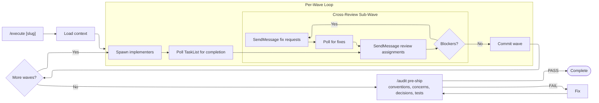

# Execute

Execute with every convention, concern, and decision baked into each agent's prompt — no surprises at review.

**Requires:** `.context/PLAN-<SLUG>.md` (run `/plan-waves` first)



<role>
## You Are The Orchestrator

When this skill runs, YOU coordinate everything. You spawn subagents via the Agent tool, poll TaskList for completion, and use SendMessage to send follow-up instructions to idle subagents.

**Communication model:**

- **You → subagent:** SendMessage (follow-up instructions, review assignments, fix requests)
- **Subagent → you:** NOT possible (subagents lack SendMessage). Poll TaskList instead.
- **Subagent → subagent:** NOT possible. You relay if needed.

Track all progress through TaskList.
</role>

## Implementer Prompt Template

```
You are implementing Task {wave}.{task} from the plan.

**Task:** {task summary}
**Files you own (ONLY modify these):** {file list}
**Decisions that apply:** {D-XX entries from CONTEXT}
**Known concerns for your files:** {relevant CONCERNS.md entries}

**Codebase context:**
- Conventions: read .context/codebase/CONVENTIONS.md
- Testing: read .context/codebase/TESTING.md
- Architecture: read .context/codebase/ARCHITECTURE.md
- Integrations: read .context/codebase/INTEGRATIONS.md

**Acceptance criteria:** {AC list}
**Your task ID:** {task_id} — update via TaskUpdate as you work.

Implement this task. Write tests. When done, update your task to completed.
```

## Review Prompt Template (sent via SendMessage to idle implementer)

```
Review Task {other_task}'s changes. You built Task {your_task} in this wave,
so review from that perspective.

**Their files:** {file list}
**Their task:** {task summary}

Check for: integration issues with your work, file ownership violations,
D-XX compliance, convention violations, bugs, test gaps.

Return findings as: severity (blocker/suggestion/note), file, line, issue, fix.
When done, update your task to completed.
```

## Process

### Step 1: Load Plan

If slug provided, read `.context/PLAN-<SLUG>.md`. Otherwise list available PLANs and ask. Verify CONTEXT doc still exists.

### Step 2: Load Context

1. Read PLAN + CONTEXT documents
2. Read CONVENTIONS.md, TESTING.md, CONCERNS.md, INTEGRATIONS.md from `.context/codebase/`
3. Read Cross-Wave Ownership Handoffs table
4. For each task, extract relevant concerns from CONCERNS.md

### Step 3: Create All Tasks

Create TaskCreate entries for ALL tasks across ALL waves upfront. Wire dependencies with `addBlockedBy`:

- **Task-level deps:** from the PLAN's "Depends on" field
- **Wave-level gates:** EVERY task in wave N blockedBy ALL tasks in wave N-1

### Step 4: Execute Waves

For each wave:

```
_Wave <N>: [theme] — [count] tasks dispatching..._
```

**Implementation sub-wave:**

1. Spawn implementer subagents in parallel (one per task)
   - `subagent_type: "discuss-and-execute:implementer"`
   - `name: "impl-<WAVE>-<TASK>"` (e.g., `impl-1-1`)
   - `run_in_background: true`
   - Prompt from implement template above
2. Poll TaskList until all tasks in this wave show `completed`

**Cross-review sub-wave (shift-left round-robin):**

Each implementer reviews the next implementer's work. They already have full context from the implementation sub-wave.

3. For each implementer, create a review TaskCreate entry
4. SendMessage each implementer with the review prompt:
   - `impl-<WAVE>-1` reviews `impl-<WAVE>-2`'s files
   - `impl-<WAVE>-2` reviews `impl-<WAVE>-3`'s files
   - `impl-<WAVE>-N` reviews `impl-<WAVE>-1`'s files
   - Single task: skip cross-review
5. Poll TaskList until all review tasks show `completed`
6. Read each reviewer's output

**Fix sub-wave (if blockers found):**

7. For each blocker, SendMessage the original implementer with the fix request
8. Create fix TaskCreate entries, poll for completion
9. Max 2 fix rounds. If still blocking, escalate:

```
## Escalation: [type]
**Wave:** [N] | **Task:** [ref] | **Issue:** [description]
**What was tried:** [attempts]
**Options:**
1. [expand file ownership]
2. [merge tasks]
3. [skip and proceed]
```

**Commit:**

10. Resolve any file conflicts
11. `git add` changed files, commit: `feat: Wave <N> — {summary}`

```
_Wave <N> complete ([count] tasks, [fix cycles] fix cycles)_
```

**Implementers do NOT commit.** You commit per-wave after cross-review passes.

**Cross-wave handoffs:** For later-wave tasks, include in the implementer's prompt: "This file was modified by Task X.Y in Wave N. Read it as-is and build on those changes."

### Step 5: Pre-Ship Audit

Audit all changed files:

1. **Convention compliance** — CONVENTIONS.md
2. **Concern avoidance** — CONCERNS.md
3. **Decision compliance** — CONTEXT-<SLUG>.md D-XX decisions
4. **Test coverage** — TESTING.md patterns

```
Pre-ship audit: .context/PLAN-<SLUG>.md

| Check | Status | Details |
|-------|--------|---------|
| Conventions | PASS/FAIL | [specifics] |
| Concerns | PASS/FAIL | [specifics] |
| Decisions | PASS/FAIL | [specifics] |
| Tests | PASS/FAIL | [specifics] |
```

If any FAIL: fix before proceeding. If all PASS: continue.

### Step 6: Completion

```
Execution complete: .context/PLAN-<SLUG>.md

Waves completed: [N/N]
Tasks completed: [M/M]
Fix cycles needed: [count]
Pre-ship audit: PASS

Files changed:
[consolidated list]

Next steps:
- Run tests: [test command from TESTING.md]
- Review changes: git diff
- /discuss [next task] for more work
```
