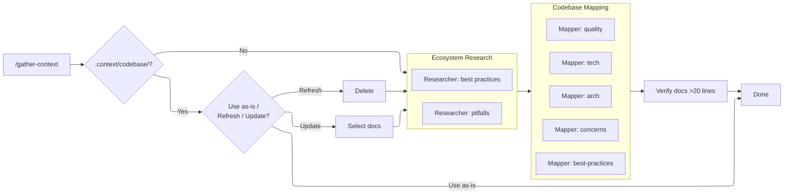

# Gather Context

**This is roughly a one-time run per repo.** It spawns 5 opus agents to deeply analyze the codebase and cache the results. Subsequent tasks use `/discuss` and `/plan-waves` which read from the cached map — they don't re-scan.

Refresh only when the codebase changes significantly (major refactor, new subsystem, etc.).



## Process

### Step 1: Check Existing Map

```bash
ls .context/codebase/*.md 2>/dev/null && wc -l .context/codebase/*.md || echo "NO_MAP"
```

**If map exists:** Present files with line counts and ask:

1. **Use as-is** — done, map is current
2. **Refresh** — delete all and remap
3. **Update specific docs** — choose which to regenerate

**If no map:** Continue to mapping.

### Step 2: Ecosystem Research

```bash
mkdir -p .context/codebase .context/research
```

Before mapping, run ecosystem research to give mapper agents current external context. Spawn 2 `researcher` agents in parallel (mode: ecosystem):

| Researcher | Question                                                                                                    | Output                                    |
| ---------- | ----------------------------------------------------------------------------------------------------------- | ----------------------------------------- |
| 1          | "What are current best practices, standard libraries, and patterns for [detected languages/frameworks]?"    | `.context/research/ecosystem-stack.md`    |
| 2          | "What are common pitfalls, deprecated patterns, and security concerns for [detected languages/frameworks]?" | `.context/research/ecosystem-pitfalls.md` |

Detect languages/frameworks by scanning config files (`Gemfile`, `package.json`, `go.mod`, `Cargo.toml`, `pyproject.toml`, etc.) before spawning — a quick `ls` is enough to identify the stack.

```
_Researching ecosystem (2 sonnet agents)..._
_stack best practices: .context/research/ecosystem-stack.md_
_stack pitfalls: .context/research/ecosystem-pitfalls.md_
```

### Step 3: Map Codebase

Spawn 5 `codebase-mapper` agents. Each agent's prompt should tell it to read its research file — do NOT read them yourself. Also tell each agent: "Read .context/research/ecosystem-\*.md for external ecosystem context."

| Agent | Agent prompt                                                                                                          | Output Docs                             |
| ----- | --------------------------------------------------------------------------------------------------------------------- | --------------------------------------- |
| 1     | `"Read $CLAUDE_PLUGIN_ROOT/skills/gather-context/references/research-tech.md and follow its instructions."`           | `STACK.md`, `INTEGRATIONS.md`           |
| 2     | `"Read $CLAUDE_PLUGIN_ROOT/skills/gather-context/references/research-arch.md and follow its instructions."`           | `ARCHITECTURE.md`, `STRUCTURE.md`       |
| 3     | `"Read $CLAUDE_PLUGIN_ROOT/skills/gather-context/references/research-quality.md and follow its instructions."`        | `CONVENTIONS.md`, `TESTING.md`          |
| 4     | `"Read $CLAUDE_PLUGIN_ROOT/skills/gather-context/references/research-concerns.md and follow its instructions."`       | `CONCERNS.md`                           |
| 5     | `"Read $CLAUDE_PLUGIN_ROOT/skills/gather-context/references/research-best-practices.md and follow its instructions."` | `<LANG>-BEST-PRACTICES.md` per language |

**Launch order:** Agents 1-4 in parallel. Agent 5 after Agent 1 completes (it reads `STACK.md` to determine which languages to assess).

**If Agent tool unavailable:** Perform 5 mapping passes sequentially using the same focus reference files.

**Surface progress** as each agent completes:

```
_Mapping codebase (5 opus agents)..._
_tech: STACK.md + INTEGRATIONS.md_
_arch: ARCHITECTURE.md + STRUCTURE.md_
_quality: CONVENTIONS.md + TESTING.md_
_concerns: CONCERNS.md_
_best-practices: [LANG]-BEST-PRACTICES.md for each language detected_
```

### Step 4: Verify & Present

```bash
wc -l .context/codebase/*.md
```

Verify all core docs exist and are >20 lines each. Present completion summary.

```
Codebase map cached at .context/codebase/:
  STACK.md                  [N] lines
  INTEGRATIONS.md           [N] lines
  ARCHITECTURE.md           [N] lines
  STRUCTURE.md              [N] lines
  CONVENTIONS.md            [N] lines
  TESTING.md                [N] lines
  CONCERNS.md               [N] lines
  RUBY-BEST-PRACTICES.md    [N] lines
  TYPESCRIPT-BEST-PRACTICES.md [N] lines
  ...

Next: /discuss [work description]
```
