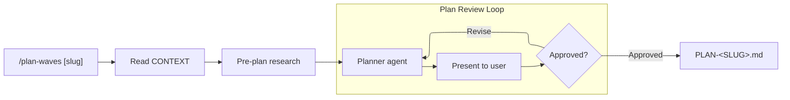

# Plan Waves

Plan with full awareness of conventions, concerns, and file ownership — so agents build it right the first time.

**Requires:** `.context/CONTEXT-<SLUG>.md` (run `/discuss` first)



## Process

### Step 1: Load Context

If slug provided as argument, read `.context/CONTEXT-<SLUG>.md`. Otherwise, list available CONTEXT docs and ask which to plan.

Also read from `.context/codebase/`:

- `ARCHITECTURE.md` and `STRUCTURE.md` — where things live, how layers communicate
- `CONVENTIONS.md` — so tasks are assigned following established patterns
- `CONCERNS.md` — so the planner avoids fragile areas or adds protective tasks
- `TESTING.md` — so test tasks use the right framework and patterns
- `STACK.md` and `INTEGRATIONS.md` — so tasks account for external services and dependencies

### Step 2: Pre-Plan Research

Before generating the plan, spawn `researcher` agents to investigate domain-specific questions raised by the CONTEXT doc. This gives the planner current external knowledge, not just codebase knowledge.

Scan the CONTEXT doc's decisions and scope for research-worthy topics — library choices, architectural patterns, integration approaches. Spawn 1-3 researchers in parallel (mode: comparison or feasibility as appropriate):

```
_Pre-plan research (<N> topics)..._
_[topic 1]: .context/research/<SLUG>-<TOPIC>.md_
_[topic 2]: .context/research/<SLUG>-<TOPIC>.md_
```

**Skip research if:** the CONTEXT doc's decisions are all internal (naming, file structure, UI layout) with no external library or pattern choices. Not every plan needs research.

**Pass research results to the planner** — include the research file paths in the planner's prompt so it reads them alongside the CONTEXT doc.

### Step 3: Generate Plan

Spawn a `planner` agent with the CONTEXT doc contents and codebase context. The agent writes the plan to `.context/PLAN-<SLUG>.md`.

Read `$CLAUDE_PLUGIN_ROOT/skills/plan-waves/references/plan-template.md` for the output template.

### Step 4: Review Plan with User

Present the generated plan — wave by wave:

- Number of waves and tasks per wave
- File ownership boundaries
- **Cross-wave handoffs** — files owned by tasks in different waves. Call these out explicitly:
  ```
  Cross-wave handoffs (files touched by multiple waves):
  - `lib/minions/epic.rb` — Task 2.2 (flock) -> Task 3.1 (parallel fetch)
  - `test/test_helper.rb` — Task 1.2 (FatalError) -> Task 4.1 (async support)
  ```
  If none: "No cross-wave handoffs — clean ownership."
- Dependency chain between waves

Ask: **Approve / Revise / Add wave / Remove task**

If revise: re-prompt the planner with the user's feedback. Max 3 revision cycles. If still not approved after 3 cycles, write the best current version and note remaining disagreements in the PLAN header.

### Step 5: Confirm

```
Plan written: .context/PLAN-<SLUG>.md

Waves: [N]
Total tasks: [M]
Estimated parallelism: [tasks in largest wave]

Next: /execute [slug]
```
